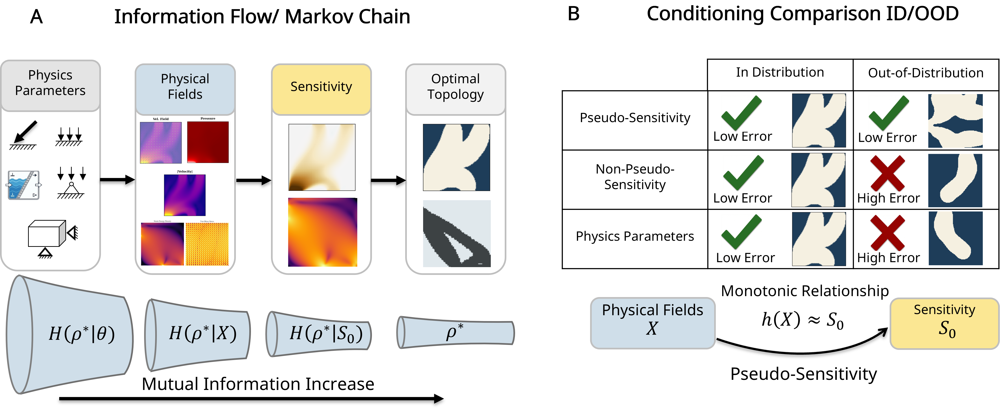
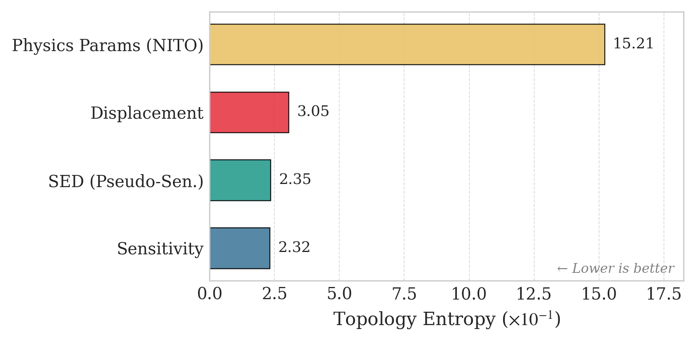
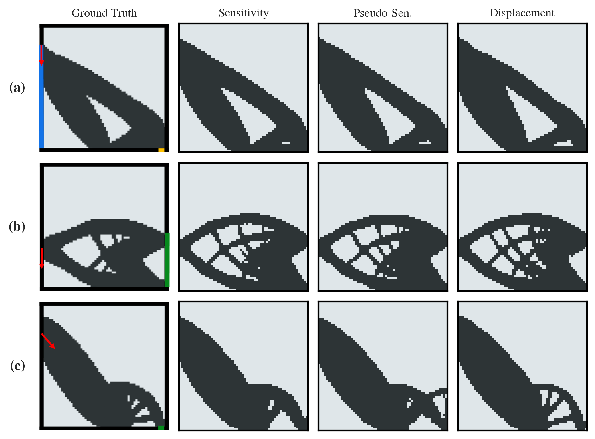
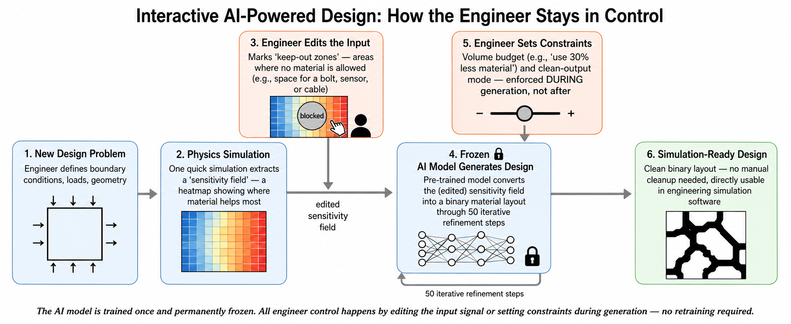
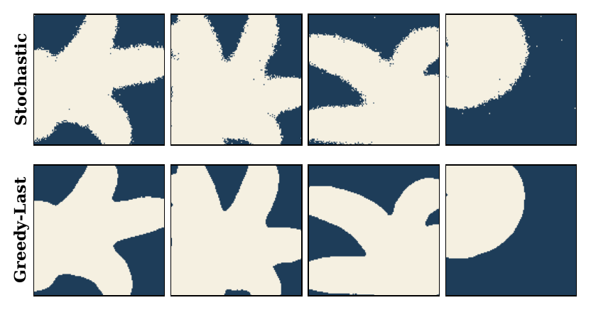
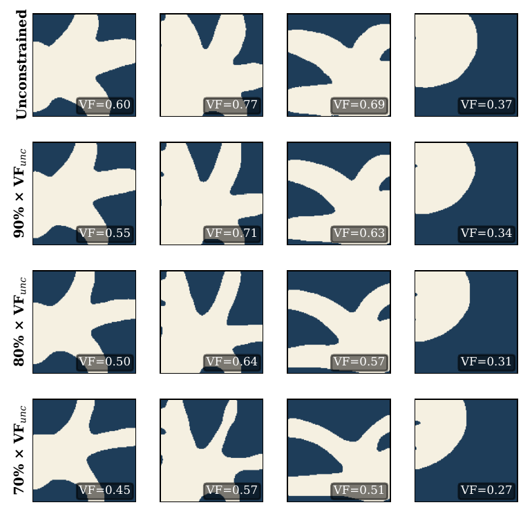
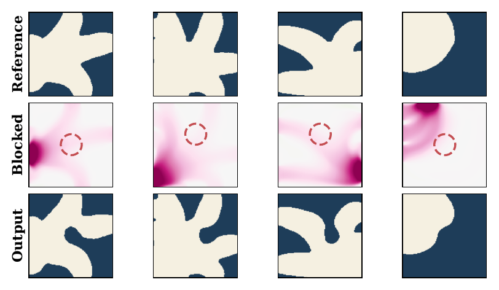
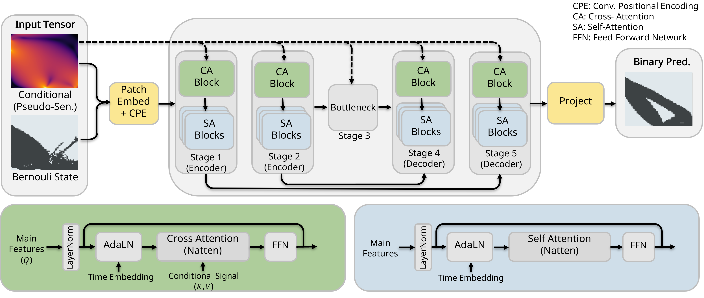

<div style="text-align: center; margin-bottom: 2em;">
  <h1 style="margin-bottom: 0.2em;">TopoTransformer</h1>
  <p style="font-size: 1.15em; color: #555; max-width: 700px; margin: 0 auto;">
    On the Generalization in Topology Optimization via<br>
    Sensitivity-Conditioned Bernoulli Flow Matching
  </p>
  <p style="margin-top: 0.8em;">
    <strong>Mohammad Rashed</strong>, Duarte F. Valoroso Madeira, Babak Gholami, Caglar Guerbuez, Yunjia Yang, Nils Thuerey
    <br><em>ICML 2026</em>
  </p>
  <p style="margin-top: 1em;">
    <a href="https://github.com/tum-pbs/topotransformer" style="text-decoration: none; padding: 8px 18px; background: #24292e; color: white; border-radius: 6px; font-weight: bold;">GitHub</a>
    &nbsp;&nbsp;
    <a href="#" style="text-decoration: none; padding: 8px 18px; background: #0366d6; color: white; border-radius: 6px; font-weight: bold;">Paper (coming soon)</a>
  </p>
</div>

<div style="text-align: center; margin: 1.5em 0;">
  
  <p style="color: #666; font-size: 0.9em; margin-top: 0.5em; max-width: 800px; margin-left: auto; margin-right: auto;">
    <strong>(A)</strong> The topology optimization pipeline forms a causal Markov chain: Physics Parameters → Physical Fields → Sensitivity → Optimal Topology.
    The Data Processing Inequality implies that sensitivity is the information-theoretically optimal conditioning signal.
    <strong>(B)</strong> Fields that approximate sensitivities via monotone transforms (<em>pseudo-sensitivities</em>) generalize OOD; information-poor fields do not.
  </p>
</div>

---

## Abstract

Surrogate models for topology optimization (TO) exhibit highly variable out-of-distribution (OOD) generalization under distribution shifts such as changing loads or boundary conditions, yet the source of this variability remains unclear. We hypothesize that OOD performance is governed by how much information the conditioning signal preserves about the adjoint sensitivity that drives classical TO. Modeling the TO pipeline as a causal Markov chain, the Data Processing Inequality establishes that the sensitivity field is an information-theoretically optimal conditioning signal for topology prediction. However, computing exact adjoint sensitivities can be expensive or unavailable in practice; we observe that certain physical fields can approximate sensitivities through monotone transformations. To formalize this, we introduce **pseudo-sensitivities** to characterize which fields enable generalization versus those that are information-poor. We then show that a sensitivity-conditioned Bernoulli flow-matching generator empirically confirms these predictions: conditioning on sensitivities yields state-of-the-art OOD performance, while increasingly distant physical fields degrade toward raw parameter conditioning. Results hold across structural TO benchmarks under load shifts and our new CFD-TO dataset under boundary-condition shifts such as multi-outlet configurations.

---

## Key Contributions

<div style="display: flex; flex-wrap: wrap; gap: 1.5em; margin: 1.5em 0;">

<div style="flex: 1; min-width: 280px; padding: 1em; border: 1px solid #e1e4e8; border-radius: 8px;">
<h3>🔄 Bernoulli Flow Matching</h3>
<p>A flow-matching formulation operating directly on binary topology fields, avoiding the mismatch between continuous generative models and discrete 0/1 optimization targets.</p>
</div>

<div style="flex: 1; min-width: 280px; padding: 1em; border: 1px solid #e1e4e8; border-radius: 8px;">
<h3>📐 Sensitivity Conditioning</h3>
<p>Conditions generation on adjoint sensitivity fields — the information-theoretically optimal signal under a causal Markov abstraction — enabling strong OOD generalization.</p>
</div>

<div style="flex: 1; min-width: 280px; padding: 1em; border: 1px solid #e1e4e8; border-radius: 8px;">
<h3>🧩 Pseudo-Sensitivities</h3>
<p>A principled framework to identify which physical fields can substitute for exact sensitivities: any field related by a monotone transform preserves the information needed for generalization.</p>
</div>

</div>

---

## Results

We evaluate on two physics domains: **CFD topology optimization** (turbulent channel flow, RANS k-ε) and **structural topology optimization** (2D compliance minimization). Both include in-distribution (ID) and out-of-distribution (OOD) test sets.

### CFD — Simulation-Level Accuracy

Topologies are evaluated through full CFD simulation in STAR-CCM+. Metrics: relative pressure-drop error (%) and 10%-accuracy.

| Model | ID Mean±Std | ID Med. | ID Acc. | OOD-M Med. | OOD-M Acc. | OOD-H Med. | OOD-H Acc. |
|-------|:----------:|:-------:|:-------:|:----------:|:----------:|:----------:|:----------:|
| DiT   | 2.59±4.21  | **1.45** | 96.4   | 3.66       | **79.4**   | 4.85       | 70.6       |
| UDiT  | **2.37±3.55** | 1.65 | **97.2** | 3.59      | 76.4       | 7.00       | 62.7       |
| PDE-T | 2.98±6.03  | 1.82   | 95.9    | 3.05       | 75.5       | 4.35       | 68.6       |
| **Ours** | 3.44±4.03 | 2.63 | 94.0   | **2.82**   | 77.6       | **2.70**   | **74.5**   |

> Our model achieves the best OOD-Hard accuracy (74.5%) and median error (2.70%), demonstrating the strongest generalization to unseen boundary conditions (3-outlet configurations never seen during training).

### CFD — Topology Cross-Entropy (BCE)

Pixel-level topology agreement evaluated without simulation. All models conditioned on sensitivity.

| Model | ID | OOD-Med | OOD-Hard |
|-------|:--:|:-------:|:--------:|
| **Ours** | **0.035** | **0.117** | **0.224** |
| UDiT  | 0.077 | 0.151 | 0.228 |
| PDE-T | 0.077 | 0.223 | 0.408 |
| DiT   | 0.174 | 0.365 | 0.640 |

### Structural — Compliance Error

Evaluated on 992 OOD samples with load configurations not seen during training.

| Model | Params (M) | Mean Err<sub>C</sub> (%) | Med. Err<sub>C</sub> (%) |
|-------|:----------:|:------------------------:|:------------------------:|
| TopoDiff | 121 | 8.57 | 1.14 |
| NITO  | 22 | 9.33 | 2.37 |
| **Ours** | **34** | **5.73** | **0.53** |

### Conditioning Signal Comparison

The choice of conditioning signal has a dramatic effect on generalization. Sensitivity and pseudo-sensitivities (e.g., strain energy density) generalize well OOD, while information-poor fields (e.g., raw displacement) degrade.

<div style="display: flex; flex-wrap: wrap; gap: 1.5em; margin: 1.5em 0; align-items: center; justify-content: center;">
  <div style="flex: 1; min-width: 300px; max-width: 500px;">
    
    <p style="text-align: center; color: #666; font-size: 0.85em;">Structural: topology entropy across conditioning signals. Sensitivity and SED (pseudo-sensitivity) produce clean topologies; physics parameters (NITO) produce noisy outputs.</p>
  </div>
  <div style="flex: 1; min-width: 300px; max-width: 500px;">
    
    <p style="text-align: center; color: #666; font-size: 0.85em;">OOD structural topologies: Ground truth vs. predictions conditioned on Sensitivity, Pseudo-Sensitivity (SED), and Displacement.</p>
  </div>
</div>

---

## Deployment Enhancements

Generative models for topology optimization face a practical gap: raw stochastic outputs contain **salt-and-pepper noise** — isolated misclassified pixels that make topologies unusable in downstream simulation software. Engineers also need control over **material budget** (volume fraction) and the ability to **block out spatial regions** (e.g., for bolts, sensors, or cables) — all without retraining.

We address this with three inference-time strategies that work with the frozen, pre-trained model:

<div style="text-align: center; margin: 1.5em 0;">
  
  <p style="color: #666; font-size: 0.9em; margin-top: 0.5em; max-width: 800px; margin-left: auto; margin-right: auto;">
    The full deployment pipeline: an engineer defines a problem, runs one simulation to extract a sensitivity field, optionally edits the input (blocking, constraints), and the frozen model generates a clean, simulation-ready topology — no retraining required.
  </p>
</div>

### Greedy Terminal Sampling

The final denoising step uses greedy (argmax) decoding instead of stochastic sampling, eliminating salt-and-pepper artifacts and producing clean binary topologies directly usable in simulation.

<div style="text-align: center; margin: 1em 0;">
  
  <p style="color: #666; font-size: 0.85em;">Top: stochastic sampling produces noisy outputs. Bottom: greedy last-step sampling yields clean, simulation-ready topologies.</p>
</div>

### Volume Fraction Control

A confidence-based progressive pruning strategy enforces material budget constraints *during* generation. Low-confidence pixels are pruned first, reducing the volume fraction while preserving structural integrity.

<div style="text-align: center; margin: 1em 0;">
  
  <p style="color: #666; font-size: 0.85em;">Progressive volume fraction reduction (100% → 90% → 80% → 70% of unconstrained VF) while maintaining topology quality.</p>
</div>

### Spatial Blocking

Engineers can mark keep-out zones in the sensitivity field — regions where no material is allowed. The model respects these constraints while optimizing the remaining topology.

<div style="text-align: center; margin: 1em 0;">
  
  <p style="color: #666; font-size: 0.85em;">Spatial blocking: the engineer marks a circular keep-out zone (middle row); the model generates a topology that avoids that region (bottom row).</p>
</div>

---

## Quick Start

```bash
# Clone and install
git clone https://github.com/tum-pbs/topotransformer.git
cd topotransformer
pip install pdetransformer
pip install -e .

# Train: our model on CFD with sensitivity conditioning
python main.py --config config/experiments/cfd-ours-sensitivity.yaml --seed 42

# Train: structural with sensitivity conditioning
python main.py --config config/structural/structural-v10-sensitivity.yaml --seed 42
```

See the [README](https://github.com/tum-pbs/topotransformer#readme) for full usage, evaluation scripts, and dataset details.

---

## Reproducing Paper Results

All experiment configurations from the paper are included. Each config fully specifies the model, conditioning signal, data, and training hyperparameters.

### CFD Experiments (12 configs)

| Config | Model | Conditioning |
|--------|-------|-------------|
| `cfd-ours-sensitivity.yaml` | Ours (BFM + Cross-Attn) | Sensitivity |
| `cfd-ours-flowmag.yaml` | Ours | Flow magnitude |
| `cfd-ours-pressure.yaml` | Ours | Pressure |
| `cfd-dit-sensitivity.yaml` | DiT | Sensitivity |
| `cfd-dit-flowmag.yaml` | DiT | Flow magnitude |
| `cfd-dit-pressure.yaml` | DiT | Pressure |
| `cfd-udit-sensitivity.yaml` | UDiT | Sensitivity |
| `cfd-udit-flowmag.yaml` | UDiT | Flow magnitude |
| `cfd-udit-pressure.yaml` | UDiT | Pressure |
| `cfd-pdet-sensitivity.yaml` | PDE-T | Sensitivity |
| `cfd-pdet-flowmag.yaml` | PDE-T | Flow magnitude |
| `cfd-pdet-pressure.yaml` | PDE-T | Pressure |

### Structural Experiments (3 configs)

| Config | Conditioning |
|--------|-------------|
| `structural-v10-sensitivity.yaml` | Sensitivity |
| `structural-v10-sed.yaml` | SED (pseudo-sensitivity) |
| `structural-v10-displacement.yaml` | Displacement |

```bash
# Run any experiment
python main.py --config config/experiments/<config>.yaml --seed 42

# Evaluate BCE on trained model
python eval/compute_bce.py --model_dir logs/<experiment> --dataset <test_data> --ema

# Evaluate structural compliance
python eval/evaluate_compliance.py --model_dir logs/<experiment> --dataset <test_data> --gt_dir <gt_path>
```

---

## Architecture

<div style="text-align: center; margin: 1.5em 0;">
  
</div>

The model uses a transformer backbone with:
- **Cross-attention conditioning** — physical fields (sensitivity, pressure, velocity) attend to topology tokens via cross-attention, keeping conditioning and generation in separate streams
- **Bernoulli flow matching** — iterative refinement from uniform random bits to binary topology via learned transition probabilities
- **Single-step inference** — at test time, the model generates a topology in one forward pass (50 refinement steps)

---

## Citation

```bibtex
@inproceedings{rashed2026generalization,
    title={On the Generalization in Topology Optimization via
           Sensitivity-Conditioned Bernoulli Flow Matching},
    author={Rashed, Mohammad and Madeira, Duarte F. Valoroso and
            Gholami, Babak and Guerbuez, Caglar and
            Yang, Yunjia and Thuerey, Nils},
    booktitle={International Conference on Machine Learning (ICML)},
    year={2026}
}
```

---

## License

This project is released under the [MIT License](https://github.com/tum-pbs/topotransformer/blob/main/LICENSE).

<div style="text-align: center; margin-top: 2em; color: #999; font-size: 0.9em;">
  Technical University of Munich — Physics-based Deep Learning Group
</div>
